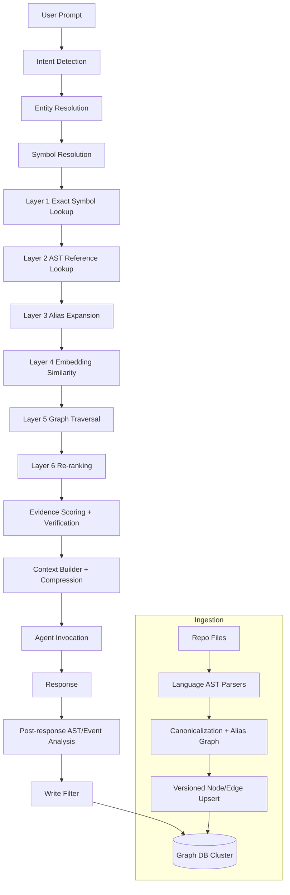
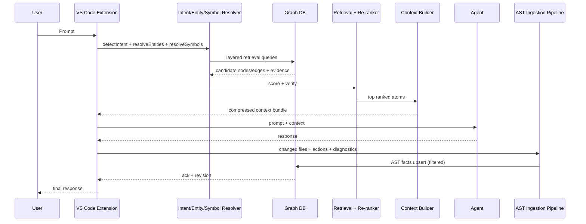

# Graph Memory Architecture (Enterprise, Deterministic, Low-Token)

Date: 2026-06-07
Scope: Production-grade graph memory for coding agents (VS Code, Copilot, Claude Code, Cursor, custom agents), with direct graph database integration and no MCP dependency.

---

## 0) Verification of Existing Store Setup (Current State)

Verified from current implementation:

- Storage is local SQLite via `better-sqlite3`, with knowledge graph tables `kg_nodes` and `kg_edges`.
- Migrations exist and are versioned (`schema_version`) with idempotent up-migrations.
- Graph ingestion runs during prompt processing (`recordWorkspaceGraph`), and retrieval currently uses concept-term seeding plus neighbor traversal (`collectGraphContext`).
- Current extraction is regex-based symbol/import detection from open file text; it is not full AST-level, cross-language canonical extraction.
- Current node taxonomy is lightweight (`prompt`, `file`, `framework`, `language`, `orm`, `auth`, `concept`) and not yet aligned to enterprise domain entities (Requirement, Bug, Fix, API, etc.).
- Current retrieval pipeline lacks explicit layered confidence gates (symbol -> AST refs -> alias -> embeddings -> traversal -> rerank), and does not include full anti-hallucination evidence constraints.

Current baseline is a good local seed but does not yet satisfy all enterprise requirements below.

---

## 1) Target Architecture Diagram



Design principle update requested by user is applied:

Prompt -> Intent Detection -> Entity Resolution -> Symbol Resolution -> Graph Retrieval -> Evidence Scoring -> Context Compression -> Agent

---

## 2) Part 1 - Memory Ingestion Design

### 2.1 Ingestion Pipeline (No Raw Chat Logs)

1. Change Capture
- Trigger on file save, git diff, test failures, terminal diagnostics, explicit user requirement updates, and accepted agent actions.
- Ignore raw conversational text unless converted into structured memory atoms (Requirement, Decision, Bug, Fix, Action).

2. Language AST Extraction
- Parse changed files into typed symbol and dependency facts.
- Emit normalized fact records:
  - Entity facts: classes, interfaces, functions, methods, APIs, DB entities.
  - Relation facts: CALLS, IMPLEMENTS, EXTENDS, IMPORTS, DEPENDS_ON, USES.
  - Provenance facts: file path, commit hash, symbol range, parser version.

3. Canonical Resolution
- Resolve aliases/synonyms to canonical node IDs before storage.
- Attach confidence score and evidence IDs.

4. Versioned Upsert
- Upsert nodes and edges with deterministic IDs and valid-time windows.
- Mark superseded facts as inactive, never hard-delete unless retention policy says so.

5. Verification + Write Filter
- Persist only if write-filter threshold passes.
- Store evidence references for every edge.

### 2.2 AST Extraction by Language

Common rule for all languages:
- Node creation: deterministic key = hash(tenant, repo, workspace, language, kind, fqName, namespace/module, signature).
- Relationship creation: only from parser/LSP evidence with file+range+parser version.
- Dedup: unique constraint on deterministic key.
- Versioning: valid_from, valid_to, revision, source_commit.
- Conflict handling: higher confidence wins; if tie, newest commit wins; unresolved ties become `CONFLICTS_WITH` edges.

#### TypeScript
- Parser: TypeScript compiler API (`ts-morph` or `typescript` Program API).
- Create nodes for Module, Class, Interface, Function, Method, TypeAlias, API route handlers.
- Relations: IMPORTS, EXPORTS, IMPLEMENTS, EXTENDS, CALLS, USES.
- Dedup by fully qualified symbol + signature.
- Versioning by git commit SHA + workspace revision.
- Conflict handling by symbol table owner (source-of-truth file path priority + latest compiled pass).

#### JavaScript
- Parser: Babel parser + ESTree traversal.
- Create Module, Function, Class, API endpoint nodes.
- Relations: IMPORTS/REQUIRES, CALLS, DEPENDS_ON.
- Dedup by module path + export name + arity heuristic.
- Versioning by commit + AST fingerprint.
- Conflict handling prefers ESM import graph over heuristic require edges.

#### Python
- Parser: Python `ast` (or tree-sitter-python for unified pipeline).
- Create Module, Class, Function, Decorated API view, ORM model entities.
- Relations: IMPORTS, INHERITS, CALLS, USES.
- Dedup by module dotted path + symbol name + parameters.
- Versioning by commit + file hash.
- Conflict handling with import resolution order (`sys.path` aware for project roots).

#### Java
- Parser: JavaParser or tree-sitter-java.
- Create Package, Class, Interface, Method, API controller, JPA entity nodes.
- Relations: IMPLEMENTS, EXTENDS, CALLS, IMPORTS, DEPENDS_ON.
- Dedup by package+type+method signature.
- Versioning by commit + build artifact version.
- Conflict handling prefers compiled symbol index (javac/LSP) over raw parse when mismatch occurs.

#### C#
- Parser: Roslyn (authoritative).
- Create Namespace, Class, Interface, Method, Controller action, EF entity nodes.
- Relations: IMPLEMENTS, EXTENDS, CALLS, USES, DEPENDS_ON.
- Dedup by Roslyn symbol ID.
- Versioning by commit + project GUID + assembly version.
- Conflict handling prefers semantic model binding over syntax-only extraction.

#### Go
- Parser: `go/parser` + `go/types` (or tree-sitter-go for syntax, `go list` for semantic).
- Create Package, Struct, Interface, Func, Method, HTTP handler, DB model nodes.
- Relations: IMPORTS, IMPLEMENTS (interface satisfaction), CALLS, DEPENDS_ON.
- Dedup by module/package/symbol signature.
- Versioning by commit + module version.
- Conflict handling uses `go list`/type-check results as authority.

### 2.3 Autonomous Memory Enrichment

- Continuous enrichers detect:
  - New requirement statements from task definitions/issue metadata.
  - New bug/fix links from failing test -> changed symbols -> passing test.
  - New architectural decisions from ADR files, config drift, or explicit agent decisions.
- Enrichers produce candidate facts, then pass through write filter and verification.

---

## 3) Part 2 - Memory Normalization (Canonical Entity Resolution)

### 3.1 Canonicalization Goal

Aliases like UserAuth, UserAuthService, Authentication, Login, Identity Service should resolve to one canonical concept node (for example, `AUTH.IDENTITY`).

### 3.2 Resolution Pipeline

1. Normalize text
- Lowercase, Unicode fold, punctuation strip, camel/snake split, stem/lemmatize.

2. Symbol-aware normalization
- Preserve code tokens and namespace cues (auth/login/identity semantics).

3. Synonym and alias graph expansion
- Domain synonym dictionary (auth <-> authentication <-> identity).
- Alias edges: `ALIAS_OF`, weighted by confidence and source count.

4. Fuzzy matching
- Jaro-Winkler + token set ratio + abbreviation expansion.

5. Embedding matching
- Compare candidate entity embeddings to canonical embedding centroids.

6. Confidence scoring
- Weighted score from lexical, structural, embedding, and usage-context overlap.

7. Resolution action
- If score >= merge_threshold: map to canonical node.
- If between soft_threshold and merge_threshold: create candidate alias edge, mark `pending_review=false` if auto-verified by evidence.
- If below soft_threshold: create new canonical node.

### 3.3 Duplicate Prevention

- Deterministic canonical ID assignment.
- Unique constraints on canonical IDs and active aliases per tenant/repo.
- Merge journal table tracks node merges/splits with reversible lineage.
- Background duplicate sweeper identifies near-duplicates and proposes merges with evidence.

---

## 4) Part 3 - Memory Storage Model (Graph Schema)

### 4.1 Node Types

Required node labels:
- Class
- Function
- Module
- API
- DatabaseTable
- Requirement
- Bug
- Fix
- UserIntent
- Session
- AgentAction

Additional operational nodes:
- Interface
- ArchitecturalDecision
- Alias
- Evidence
- Repository
- Workspace
- Commit

### 4.2 Relationship Types

Required relationships:
- CALLS
- IMPORTS
- IMPLEMENTS
- EXTENDS
- USES
- DEPENDS_ON
- FIXES
- RELATES_TO
- SATISFIES
- GENERATED_BY
- MODIFIED_BY

Additional safety relationships:
- ALIAS_OF
- SUPPORTED_BY (edge -> evidence)
- CONFLICTS_WITH
- OBSERVED_IN (entity -> session/commit)

### 4.3 Node Properties

Common:
- node_id (stable deterministic)
- tenant_id, repo_id, workspace_id
- node_type
- canonical_name
- display_name
- language
- file_path, symbol_range
- embedding_ref
- confidence
- created_at, updated_at
- valid_from, valid_to
- source_commit
- source_parser
- revision
- active (boolean)

### 4.4 Edge Properties

Common:
- edge_id (stable deterministic)
- src_node_id, dst_node_id
- relation_type
- confidence
- weight
- evidence_count
- created_at, updated_at
- valid_from, valid_to
- source_commit
- active

### 4.5 Indexes and Constraints

- Unique: (tenant_id, repo_id, workspace_id, node_id)
- Unique: (tenant_id, repo_id, workspace_id, canonical_name, node_type, active=true)
- Unique edge: (tenant_id, repo_id, workspace_id, src_node_id, dst_node_id, relation_type, active=true)
- Indexes:
  - canonical_name
  - file_path + symbol_range
  - updated_at
  - relation_type
  - source_commit
  - confidence DESC
- Vector index for embeddings (HNSW/IVF depending backend).

### 4.6 Sharding Strategy

- Primary shard key: tenant_id + repo_id.
- Secondary partition: workspace_id and time buckets for high-churn edges.
- Keep hot partitions in primary graph cluster; archive stale partitions into read-only tier with summarized projections.

### 4.7 Scaling Strategy (Millions of Nodes)

- Use read replicas for retrieval, dedicated write leaders for ingestion.
- Batch upserts with idempotent retries.
- Maintain materialized subgraph projections per workspace and per domain (auth, billing, api).
- Periodic edge compaction: aggregate repeated low-information edges.
- TTL on low-confidence transient nodes.

---

## 5) Part 4 - Retrieval Engine (Layered, Deterministic)

Never use plain keyword retrieval as primary strategy.

### Layer 1: Exact Symbol Lookup
- Input: normalized prompt symbols + active file symbols.
- Output: exact symbol node candidates.
- Confidence: 1.00 for exact signature, 0.95 for exact name+module.

### Layer 2: AST Reference Lookup
- Input: Layer 1 nodes + local AST call/import/reference graph.
- Output: directly referenced nodes/edges (1-hop).
- Confidence: 0.85-0.95 based on parser authority.

### Layer 3: Alias Expansion
- Input: Layer 1/2 nodes.
- Output: canonical and alias-equivalent nodes.
- Confidence: alias edge confidence propagated with decay.

### Layer 4: Embedding Similarity
- Input: unresolved entities/intents and graph entity embeddings.
- Output: semantically similar candidate nodes.
- Confidence: cosine similarity calibrated per domain.

### Layer 5: Graph Traversal
- Input: candidate node frontier from Layers 1-4.
- Output: bounded k-hop relevant neighborhood (typed traversal rules).
- Confidence: path confidence = product of edge confidences with decay by hop distance.

### Layer 6: Re-ranking
- Input: union of all candidates with evidence metadata.
- Output: top-N context atoms for builder.
- Confidence: final relevance score from formula in Part 5.

### Retrieval Pseudocode

```text
retrieve(prompt, ideContext):
  intent = detectIntent(prompt)
  entities = resolveEntities(prompt, ideContext)
  symbols = resolveSymbols(entities, ideContext)

  c1 = exactSymbolLookup(symbols)
  c2 = astReferenceLookup(c1, ideContext.ast)
  c3 = aliasExpand(c1 + c2)
  c4 = embeddingLookup(entities - resolved(c1..c3))
  c5 = graphTraverse(c1 + c2 + c3 + c4, ruleset, maxHops)

  candidates = union(c1,c2,c3,c4,c5)
  verified = verifyEvidence(candidates)
  return rerank(verified)
```

---

## 6) Part 5 - Relevance Scoring Formula

Let:
- E = exact match score
- S = symbol match score
- F = file proximity score
- G = graph distance score
- U = usage frequency score
- R = recency score
- M = embedding similarity score
- V = evidence verification multiplier

Final score:

$$
RelevanceScore = V \cdot (w_e E + w_s S + w_f F + w_g G + w_u U + w_r R + w_m M)
$$

Suggested default weights:

- $w_e = 0.24$
- $w_s = 0.20$
- $w_f = 0.14$
- $w_g = 0.14$
- $w_u = 0.08$
- $w_r = 0.08$
- $w_m = 0.12$

With constraints:

$$
\sum w_i = 1, \quad 0 \le w_i \le 1
$$

Evidence multiplier:
- $V = 1.0$ when parser/LSP evidence exists.
- $V = 0.7$ when evidence is indirect.
- $V = 0.0$ when no evidence (candidate rejected).

Weight tuning:
- Offline: optimize NDCG@k and MRR on labeled retrieval traces.
- Online: contextual bandit on acceptance/correction feedback.
- Per-language calibration: tune $w_s$ and $w_f$ upward for strongly typed languages.

---

## 7) Part 6 - Context Construction (1000/2000/4000 tokens)

Priority order:
1. Directly matched nodes
2. Connected nodes
3. Architectural decisions
4. Historical fixes
5. Agent memory

### Budget Profiles

- 1000 tokens:
  - P1: 55%
  - P2: 25%
  - P3: 10%
  - P4: 7%
  - P5: 3%

- 2000 tokens:
  - P1: 45%
  - P2: 30%
  - P3: 12%
  - P4: 8%
  - P5: 5%

- 4000 tokens:
  - P1: 38%
  - P2: 30%
  - P3: 14%
  - P4: 10%
  - P5: 8%

### Pruning Logic

- Remove duplicates by canonical node ID.
- Remove stale items where valid_to < now unless no active replacement exists.
- Drop low-confidence atoms below threshold.
- Prefer shorter evidence-backed snippets over long summaries.
- Enforce diversity cap per relation type and per module to avoid context monopolies.
- Last-mile compression:
  - keep symbol signatures
  - keep evidence pointers
  - remove prose filler

Context builder pseudocode:

```text
buildContext(candidates, budget):
  buckets = groupByPriority(candidates)
  selected = []
  for p in [1..5]:
    selected += takeTop(buckets[p], budget[p], diversityRules)
  selected = pruneDuplicates(selected)
  selected = pruneLowConfidence(selected)
  selected = compress(selected)
  return enforceTokenLimit(selected, budget.total)
```

---

## 8) Part 7 - Memory Write Filter

Save only:
- New architecture
- New bug fixes
- New dependencies
- New APIs
- New business rules

Do not save:
- Small talk
- Temporary debugging chatter
- Repeated information
- Generated explanations

### Write Filter Decision

Persist if all hold:
- novelty_score >= 0.60
- evidence_score >= 0.80
- canonical_confidence >= 0.78
- policy_class in {architecture, bugfix, dependency, api, business_rule}

Otherwise drop or stage for delayed verification.

---

## 9) Part 8 - Anti-Hallucination Layer

Mechanisms:

1. Evidence tracking
- Every edge must reference at least one Evidence node (file path, range, commit, parser id).

2. Source attribution
- Response context includes source pointers for each retrieved atom.

3. Confidence levels
- Candidate confidence and verification level attached to each atom.

4. Verification steps
- Symbol exists check
- Edge existence check
- Valid-time check
- Contradiction check

5. Contradiction detection
- If two active facts conflict, create `CONFLICTS_WITH`, lower confidence, and request disambiguation from latest commit or authoritative parser.

Hard rule:
- If evidence missing, atom is excluded from final context and cannot be surfaced to agent.

---

## 10) Part 9 - VS Code Integration Flow

Pipeline:

User Prompt
-> Context Detection
-> Graph Retrieval
-> Context Compression
-> Agent Invocation
-> Response
-> AST Analysis
-> Memory Update

Detailed sequence:



No MCP is required. Integration is direct via graph DB driver inside extension/sidecar runtime.

---

## 11) Part 10 - Failure Testing Matrix

| Scenario | Failure mode | Detection | Recovery strategy |
|---|---|---|---|
| UserAuth vs Authentication | Alias split causes missed recall | low overlap + duplicate canonical candidates | alias merge proposal, canonical remap, replay affected edges |
| Misspelled entities | lookup miss | edit distance anomaly + low exact hits | fuzzy + embedding fallback, then human-confirmed alias if repeated |
| Ambiguous symbols | wrong target module | same symbol in multiple modules | prioritize active file/module proximity and import graph |
| Massive graph DB | latency spikes | p95 retrieval SLA breach | precomputed projections, cache hot subgraphs, limit traversal fanout |
| Multiple repositories | cross-repo contamination | tenant/repo mismatch in evidence | enforce tenant+repo scoping in all queries |
| Circular dependencies | traversal loops | visited-node loop detector | path dedupe + max hop + cycle-safe traversal |
| Duplicate entities | graph bloat | duplicate sweeper high-similarity pairs | merge transaction with lineage journal |
| Missing nodes | incomplete context | unresolved references from AST | on-demand re-index of impacted files/modules |
| Outdated memories | stale facts win ranking | valid_to expired or stale confidence decay | recency penalty + stale marker + refresh extraction |
| Conflicting memories | contradictory edges | conflict rule violations | mark conflicts, demote confidence, resolve by authoritative evidence |

---

## 12) Part 11 - Production Improvements and Critique

### Bottlenecks

- Write amplification from per-event edge inserts.
- Traversal fanout in dense modules.
- Entity normalization latency under high alias churn.

### Scaling Issues

- Hot repositories can dominate shared partitions.
- Embedding search costs grow without tiered indexing.

### Retrieval Failure Risks

- Over-reliance on embeddings can introduce semantic drift.
- Alias over-merge can collapse distinct bounded contexts.

### Graph Explosion Risks

- Session/action nodes can explode without TTL/compaction.
- Duplicate low-confidence edges can accumulate.

### Memory Drift Risks

- Historical fixes may become invalid after refactors.
- Canonical entities can become stale when architecture changes.

### Token Inefficiencies

- Excess connected-node expansion can crowd out direct matches.
- Verbose historical explanations can consume budget without actionability.

### Production-ready Recommendations

1. Adopt strict evidence-required writes and retrieval.
2. Enforce deterministic ID + canonicalization before any upsert.
3. Run hourly duplicate/contradiction sweeps with bounded auto-merge.
4. Use bounded traversal policies by intent (bugfix vs feature vs refactor).
5. Maintain hot/cold graph tiers and summarize old subgraphs.
6. Keep context builder budgeted with per-priority quotas and diversity guards.
7. Continuously tune relevance weights with offline labels and online feedback.
8. Treat write filter as policy engine, not heuristic-only logic.
9. Keep a full merge/split lineage journal for auditability and rollback.
10. Keep AST extractor versions explicit and reproducible for deterministic retrieval.

---

## Final Output Checklist (Requested)

1. Architecture diagram: included in Sections 1 and 10.
2. Graph schema: Section 4.
3. Retrieval algorithm: Section 5.
4. Ingestion algorithm: Section 2.
5. Relevance formula: Section 6.
6. Context builder: Section 7.
7. Anti-hallucination layer: Section 9.
8. VSCode integration flow: Section 10.
9. Scaling strategy: Sections 4.7 and 12.
10. Production recommendations: Section 12.

---

## Implementation Notes for This Repository

To evolve from current SQLite-local KG toward enterprise graph memory without breaking existing sessions:

- Keep existing SQLite KG path as local fallback tier.
- Introduce `GraphStore` interface with adapters:
  - `SqliteGraphStore` (current behavior)
  - `Neo4jGraphStore` (or equivalent direct graph backend)
- Route ingestion/retrieval through adapter while preserving current CLI commands and extension flow.
- Roll out layered retrieval and canonicalization behind feature flags, then progressively enable by workspace.

This allows deterministic migration with zero-session-break behavior and rollback safety.
