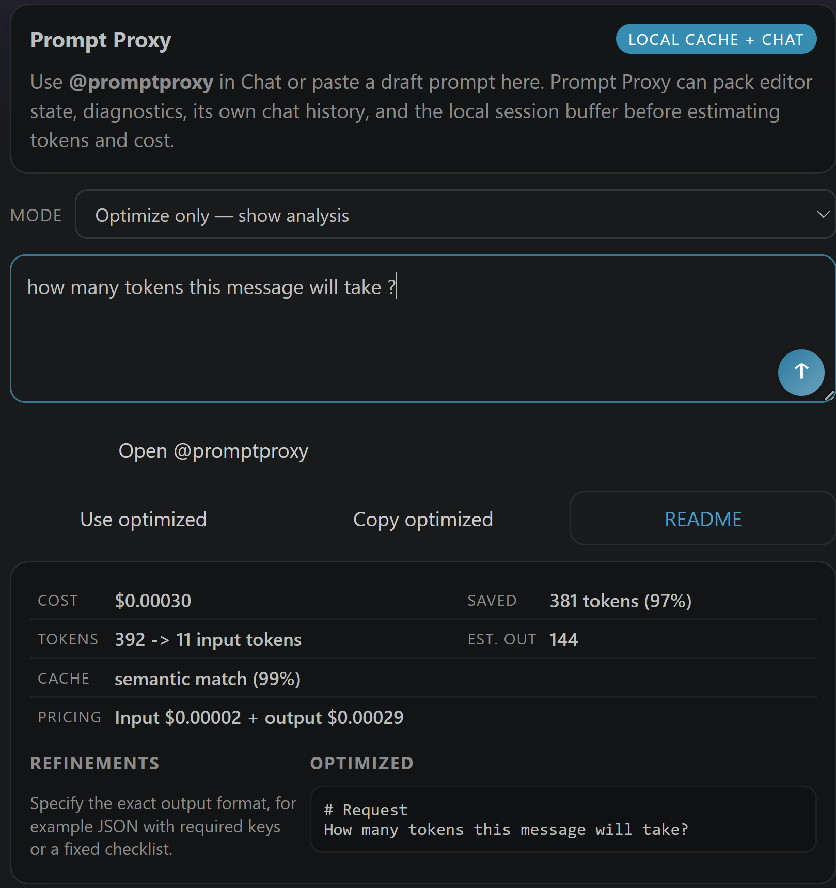

# Prompt Proxy for VS Code

A local prompt optimizer, semantic cache, and conversational AI agent — all running inside VS Code without leaving your editor.



---

## What it does

Prompt Proxy sits between you and Copilot. Before your prompt reaches the model it:

1. **Compresses** filler words, softeners, and redundant phrasing
2. **Checks the local semantic cache** — reuses a prior result if a similar prompt was already answered
3. **Packs workspace context** — active file, open editors, diagnostics, recent saves
4. **Estimates token cost** before the request is sent
5. **Calls Copilot and streams the answer** directly in the sidebar (Agent mode) or hands you the optimized prompt to review first (Optimize mode)
6. **Remembers the conversation** across turns per workspace so follow-up pronouns ("fix it", "add tests for that") resolve correctly

---

## Modes

Select the mode from the **Mode** dropdown in the sidebar or via the status bar item (`$(robot) Proxy [Agent]`).

| Mode | Status bar label | Behaviour |
|---|---|---|
| **Agent** *(default)* | `$(robot) Proxy [Agent]` | Type in the sidebar → optimize → Copilot answers → response streams in the sidebar. No `@promptproxy` needed. |
| **Optimize only** | `$(wand) Proxy [Optimize]` | Shows analysis table (cost, tokens saved, cache status) and the optimized prompt. You decide when to send. |
| **Direct send** | `$(comment-discussion) Proxy [Direct]` | Opens the Chat panel with `@promptproxy <your prompt>` pre-filled. |

Switch mode any time by:
- Clicking the status bar label (`$(robot) Proxy [Agent]`) → QuickPick
- Changing the **Mode** dropdown in the sidebar
- Typing `@promptproxy /mode agent` (or `optimize` / `direct`) in Chat

---

## Sidebar panel — Prompt Proxy Control

Open it from the Chat sidebar or press the status bar item.

```
┌──────────────────────────────────┐
│  Prompt Proxy       Local cache  │
│  Mode  [ Agent ▾ ]               │
│ ┌──────────────────────────────┐ │
│ │ Type your prompt here…      ↑│ │  ← send button (icon, like Copilot)
│ └──────────────────────────────┘ │
│  ⚠ Alerts (secrets, errors)      │
│  [ Open @promptproxy ]           │
│  [ Use optimized ] [Copy] [Docs] │
│                                  │
│  ┌── Analysis table ──────────┐  │
│  │ Cost │ $x  │ Saved │ n tok │  │
│  │ Tok  │ n→m │ Est.  │ n out │  │
│  │ Cache│ semantic 82%        │  │
│  │ Price│ in $x + out $y      │  │
│  └─────────────────────────────┘ │
│  Refinements │ Optimized prompt  │
│  • use nouns │ [compressed text] │
│                                  │
│  ┌── Copilot response ────────┐  │
│  │ streaming…                  │  │
│  └─────────────────────────────┘ │
└──────────────────────────────────┘
```

### Send button

The circular **↑** button inside the textarea behaves like the Copilot send button — hover shows the current mode action ("Run Agent — optimize + call Copilot").

---

## Chat participant — `@promptproxy`

Type in the VS Code Chat panel:

```text
@promptproxy refactor the auth middleware to use async/await
```

Every message is automatically optimized. Copilot's answer streams back in chat.

### Commands

| Command | Effect |
|---|---|
| `@promptproxy /mode agent` | Switch to Agent mode |
| `@promptproxy /mode optimize` | Switch to Optimize mode |
| `@promptproxy /mode direct` | Switch to Direct send mode |
| `@promptproxy /memory` | Show stored conversation turns for this workspace |
| `@promptproxy /clear` | Clear conversation memory for this workspace |
| `@promptproxy /context` | Show what local context (files, logs, cache) is available |

### Conversation memory

Up to **12 turns per workspace** are remembered. Back-references resolve automatically:

```
Turn 1: "refactor the auth middleware to async/await"
Turn 2: "now add unit tests for it"
         ↑ proxy injects "[Continuing from: 'refactor…']" before sending
```

---

## Analysis table (Optimize mode)

After analyzing a prompt, the result card shows a compact table:

| Row | Values |
|---|---|
| Cost / Saved | Total estimated USD cost · tokens saved |
| Tokens | Raw → optimized token count · estimated output |
| Cache | exact hit / semantic match (%) / miss |
| Pricing | Input + output cost breakdown |

Below the table, **Refinements** and the **Optimized prompt** sit side by side.

---

## Secret detection

If your prompt contains what looks like an API key, token, or private key header, a ⚠️ alert appears in the panel before anything is sent. Patterns detected:

- OpenAI keys (`sk-…`)
- Anthropic keys (`sk-ant-…`)
- GitHub tokens (`ghp_…`, `ghs_…`)
- AWS access keys (`AKIA…`)
- PEM private key headers
- Generic `password=`, `token=`, `api_key=` assignments

---

## Semantic cache

The local SQLite cache stores every prompt you send and builds embeddings for semantic similarity. On future prompts it checks for:

- **Exact match** — returns the cached optimized version instantly
- **Semantic match** (≥ 68% cosine similarity) — returns and boosts confidence score
- **Miss** — optimizes fresh, writes to cache

The cache is seeded on activation from your git log, Copilot chat history, README, package.json, and AI instruction files (`.github/copilot-instructions.md`, `AGENTS.md`, etc.).

Manage via command palette:
- `Prompt Proxy: Show Cache Statistics`
- `Prompt Proxy: Clear Semantic Cache`

---

## Command palette

| Command | Description |
|---|---|
| `Prompt Proxy: Select Mode (Agent / Optimize / Direct)` | Open mode QuickPick |
| `Prompt Proxy: Open Chat Participant` | Jump to `@promptproxy` in Chat |
| `Prompt Proxy: Focus Control Panel` | Focus the sidebar panel |
| `Prompt Proxy: Optimize Clipboard & Cost Forecast` | Optimize whatever is on the clipboard |
| `Prompt Proxy: Copy Last Optimized Prompt` | Copy the last result to clipboard |
| `Prompt Proxy: Send Last Optimized Prompt To Chat` | Open Chat with last result |
| `Prompt Proxy: Show Cache Statistics` | Show entry count, avg confidence, total hits |
| `Prompt Proxy: Clear Semantic Cache` | Wipe the local SQLite cache |
| `Prompt Proxy: Clear Conversation Memory` | Clear this workspace's conversation history |

---

## Configuration

| Setting | Default | Description |
|---|---|---|
| `promptProxy.dbPath` | *(global storage)* | Custom path for the SQLite cache file |
| `promptProxy.processingMode` | `blocking` | `blocking` or `non-blocking` cache lookup |
| `promptProxy.enableSessionContext` | `true` | Feed recent turns back as session history |
| `promptProxy.pricingInput` | `0.0015` | Input cost per 1K tokens (USD) |
| `promptProxy.pricingOutput` | `0.002` | Output cost per 1K tokens (USD) |
